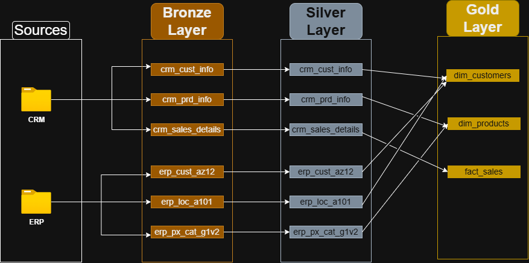
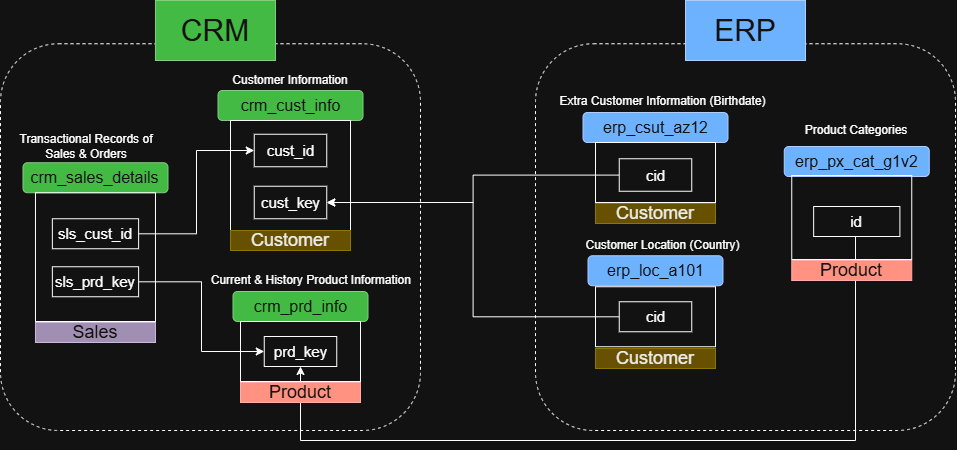
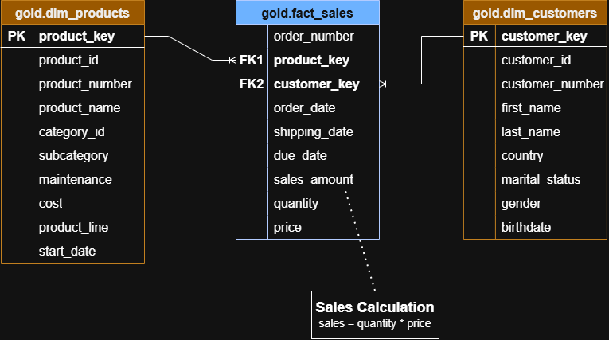

# Data Warehouse

## Descripción

Construcción de un Data Warehouse en SQL Server para aplicar conceptos fundamentales de Data Engineering y modelado dimensional.

El proyecto implementa una arquitectura Medallion compuesta por las capas Bronze, Silver y Gold. Los datos provenientes de fuentes CRM y ERP son incorporados, transformados, integrados y finalmente organizados en un modelo dimensional orientado al análisis.

El foco del proyecto estuvo en comprender y aplicar conceptos de integración de datos, transformación y validación, modelado dimensional, surrogate keys y controles de calidad a lo largo del flujo de datos.

## Arquitectura

El flujo de datos se organiza de la siguiente manera:

```text
Fuentes CRM / ERP
       │
       ▼
    Bronze
       │
       ▼
    Silver
       │
       ▼
     Gold
       │
       ▼
Consumo analítico
```

Cada capa tiene una responsabilidad específica:

* **Bronze:** incorpora los datos de las fuentes manteniendo su estructura y contenido lo más cerca posible del origen.
* **Silver:** realiza la limpieza, validación, estandarización y transformación de los datos.
* **Gold:** integra los datos transformados y los presenta mediante un modelo dimensional orientado al análisis.

### Flujo de datos

El siguiente diagrama muestra el recorrido de los datos desde las fuentes hasta la capa Gold:



[Ver diagrama editable](docs/data_flow.drawio)

### Integración de fuentes

La integración entre las diferentes fuentes CRM y ERP se encuentra representada en el siguiente modelo:



[Ver diagrama editable](docs/integration_model.drawio)

## Modelo dimensional

La capa Gold representa un modelo dimensional compuesto por:

* `gold.dim_customers`
* `gold.dim_products`
* `gold.fact_sales`

Las dimensiones utilizan surrogate keys propias del Data Warehouse para establecer las relaciones con la tabla de hechos.

En este proyecto, las entidades de Gold se implementaron como **views de SQL Server**, por lo que el modelo dimensional se construye lógicamente a partir de los datos disponibles en Silver sin almacenar una nueva copia física de la información.

### Modelo de datos

El modelo dimensional se encuentra representado en el siguiente diagrama:



[Ver diagrama editable](docs/data_mart.drawio)

## Controles de calidad

Se implementaron controles de calidad en las capas Silver y Gold con objetivos diferentes.

En **Silver**, los controles verifican la calidad y consistencia de los datos luego de aplicar las transformaciones, incluyendo duplicados, valores nulos, fechas inválidas y otras condiciones específicas de cada entidad.

En **Gold**, los controles verifican la integridad del modelo dimensional, incluyendo la correspondencia entre los registros de la tabla de hechos y sus dimensiones y la unicidad de las surrogate keys.

Los scripts de validación se encuentran en:

* [`scripts/silver/quality_checks.sql`](scripts/silver/quality_checks.sql)
* [`scripts/gold/quality_checks.sql`](scripts/gold/quality_checks.sql)

## Tecnologías

* SQL Server
* Medallion Architecture
* Dimensional Modeling
* Git / GitHub

## Estructura del repositorio

```text
data-warehouse-project/
│
├── datasets/
│   ├── source_crm/
│   └── source_erp/
│
├── docs/
│   ├── data_flow.drawio
│   ├── data_flow.png
│   ├── data_mart.drawio
│   ├── data_mart.png
│   ├── integration_model.drawio
│   ├── integration_model.png
│   └── decisions.md
│
├── scripts/
│   ├── bronze/
│   │   ├── ddl.sql
│   │   └── load.sql
│   │
│   ├── silver/
│   │   ├── ddl.sql
│   │   ├── load.sql
│   │   └── quality_checks.sql
│   │
│   └── gold/
│       ├── ddl.sql
│       └── quality_checks.sql
│
└── .gitignore
```

## Decisiones técnicas

Las principales decisiones tomadas durante el desarrollo y sus justificaciones se encuentran documentadas en [`docs/decisions.md`](docs/decisions.md).

El documento aborda, entre otros aspectos:

* implementación de Gold mediante views
* uso de surrogate keys
* integración de información CRM y ERP
* responsabilidades de las capas Bronze, Silver y Gold
* transformaciones y controles de calidad

## Referencias

Los datos utilizados en este proyecto y la estructura conceptual de referencia fueron obtenidos de **Data With Baraa** como parte de su proyecto educativo de Data Warehouse.
